---

<br />

# 1. GitHub Repository에 팀원 초대하기

제가 혼자 진행중인 프로젝트에 팀원을 초대하고, 어떻게 협업을 할 수 있을지 알아보겠습니다.

사실 팀원이 없어서 제가 아이디를 하나 더 만들고 진행하겠습니다.

제가 `hhejo`이고 레포지토리 관리자로서 팀원 `heejoo`를 초대해보겠습니다.

GitHub에서 본인이 진행하는 프로젝트의 Repository로 들어갑니다.

상단 링크에서 `Settings`를 클릭합니다.

좌측 메뉴에서 `Access`의 `Collaborators`를 클릭합니다.

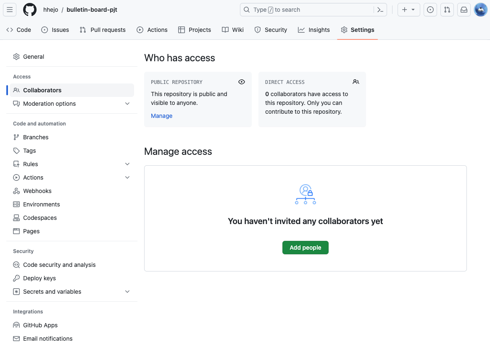

`Manage access` 아래 `Add people` 버튼을 클릭합니다.

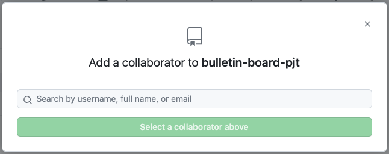

초대할 팀원의 닉네임이나 이메일 등을 작성해 초대합니다.

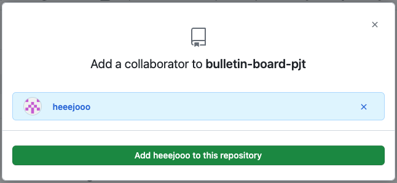

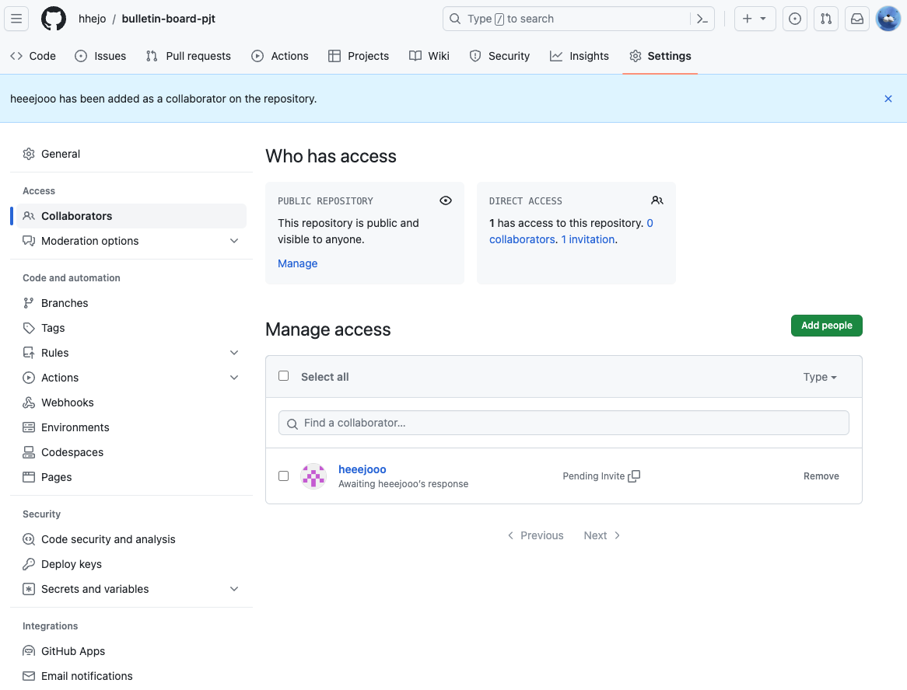

이제 팀원은 초대를 수락하면 됩니다.

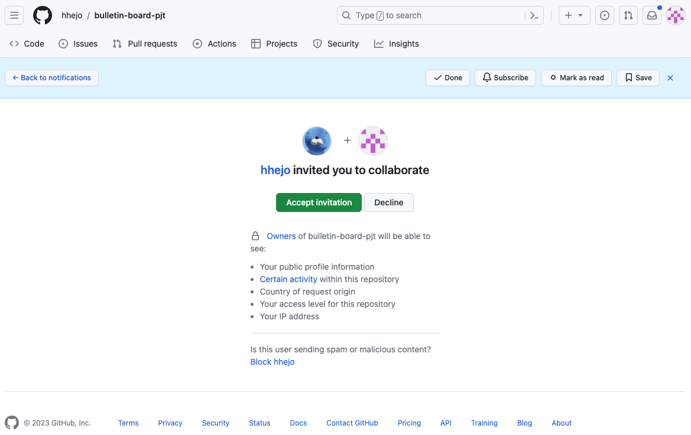

<br />
<br />

# 2. master branch 에서 develop branch 나누기

`master` 브랜치는 매우 중요한 브랜치입니다.

해당 브랜치에 아무나 다른 브랜치를 무턱대고 merge하거나, push 하거나, `master` 브랜치를 삭제한다면 곤란해집니다.

충돌이 발생할 수도 있고, 다른 팀원들이 깃 플로우를 따라오는 데에 힘겨워질 수 있습니다.

`master` 브랜치에서 `develop` 브랜치를 나누고, 우리는 `develop` 브랜치에서 주 업무를 진행하겠습니다.

Repository 화면에서 좌측의 `master` 버튼을 누르고 `develop` 이름의 브랜치를 생성합니다.

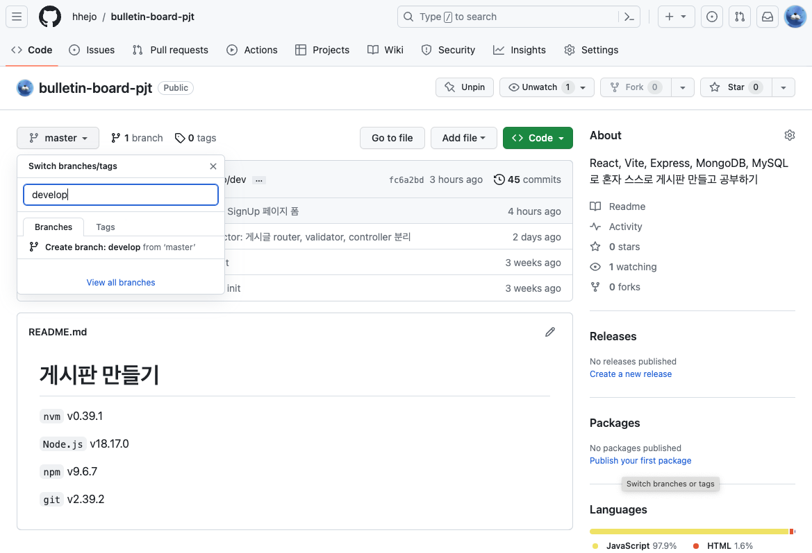

`develop` 브랜치가 생성과 함께 선택되었습니다.

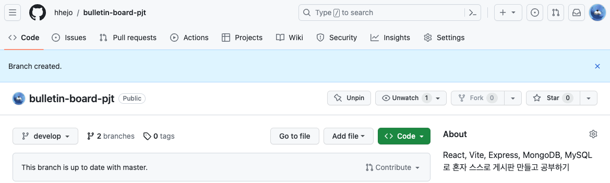

# 3. master branch 보호하기

더욱 안전하게, master 브랜치에 머지를 시도하는 경우 Pull Request를 필요로 하게 하고, 해당 Request의 승인을 요구하게 만들고 직접 Push도 할 수 없게 설정하겠습니다.

`Settings`의 `Code and automation`의 `Branches`를 클릭하고 브랜치 보호 규칙을 추가합니다.

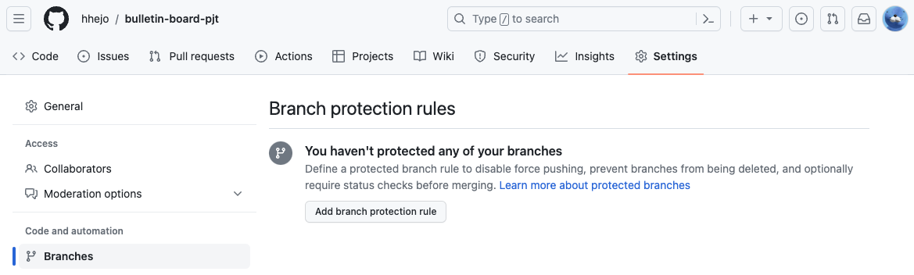

`Require a pull request before merging`의 `Require approvals`,

그리고 `Lock branch`만 체크하고 생성합니다.

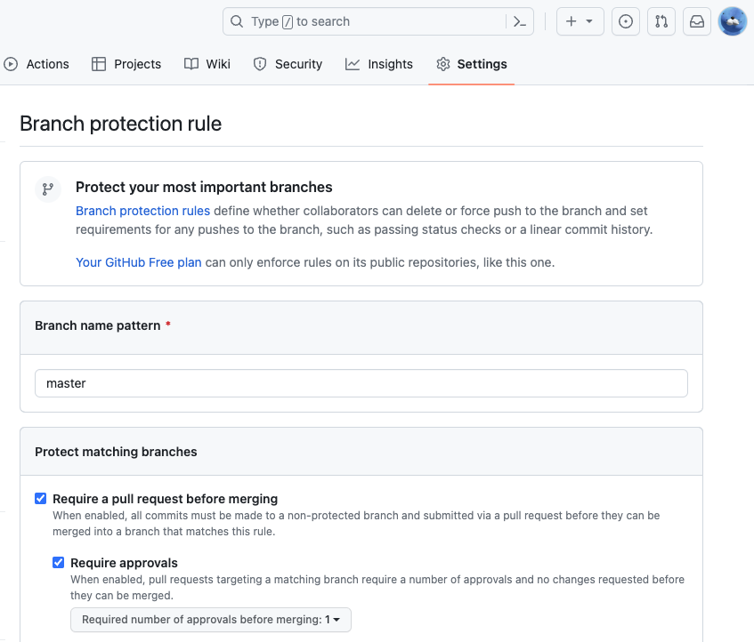

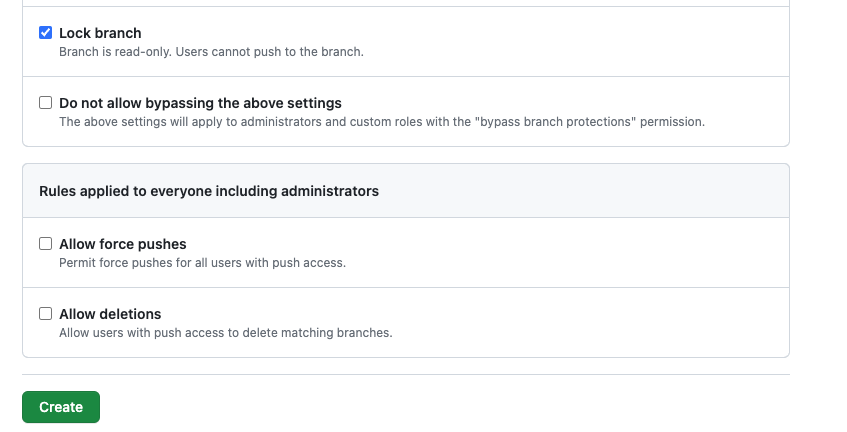

<br />
<br />

# 4. Local에서 remote branch 가져오기

`git branch`로 로컬 깃 브랜치를 조회합니다. `-r`은 원격 브랜치만 조회하고 `-a`는 local, remote 까지 포함해 조회합니다.

```bash
git branch
* master
git branch -r
  origin/master
git branch -a
* master
  remotes/origin/master
```

`git remote update`를 통해 원격 브랜치를 로컬로 업데이트합니다.

```bash
git remote update
https://github.com/hhejo/node-practice URL에서
 * [새로운 브랜치]   develop    -> origin/develop
git branch -r
  origin/develop
  origin/master
```

`git switch -t 원격_브랜치_이름`로 로컬로 브랜치를 가져옵니다.

```bash
git switch -t origin/develop
branch 'develop' set up to track 'origin/develop'.
새로 만든 'develop' 브랜치로 전환합니다
git branch -a
* develop
  master
  remotes/origin/develop
  remotes/origin/master
```

참고로 브랜치 조회 화면에서 `q`를 누르면 빠져나옵니다.

# 5. 로컬에서 작업하기

`develop` 브랜치에서 `feature` 브랜치를 생성하고 거기에서 작업한 후, 깃허브에 Push 해보겠습니다.

`feature` 브랜치에서 간단한 커밋을 한 후, 깃허브 레포지토리에 푸시합니다.

```bash
# (작업..)
git add .
git commit -m 'Merge Test'
git push origin feature
```

<br />
<br />

# 6. 깃허브에서 Pull Request 생성하기

이제 깃허브에 `Compare & pull request` 버튼이 나타날 텐데 이것을 누르면 됩니다.

만약 뜨지 않는다면, 직접 Pull Request를 생성합니다.

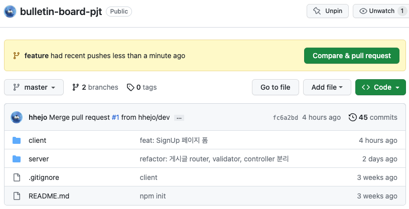

`base: develop`과 `compare: feature`가 될 수 있도록 주의 깊게 설정합니다.

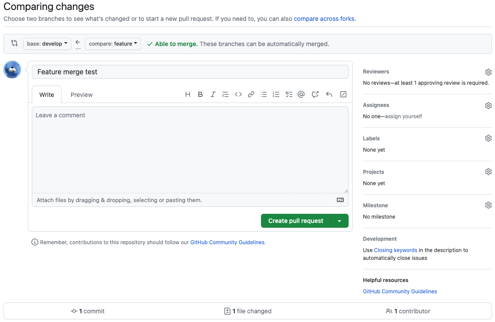

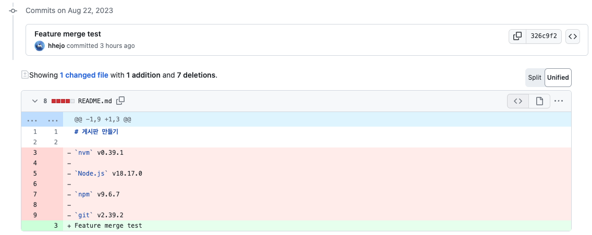

버튼을 눌러 Pull Request가 생성됐습니다.

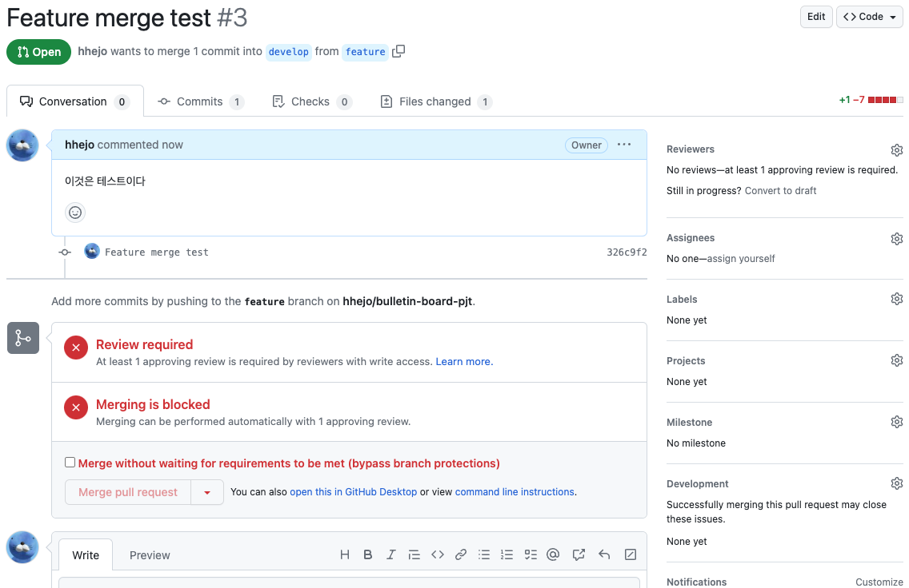

# 7. Review 작성하기

팀원이 해당 Pull Request의 Review를 작성합니다.


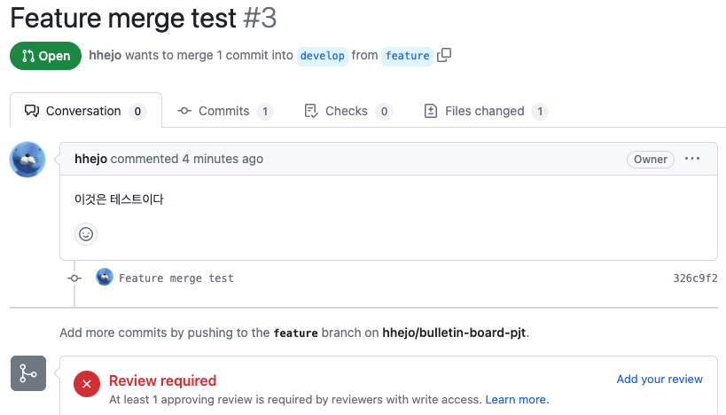

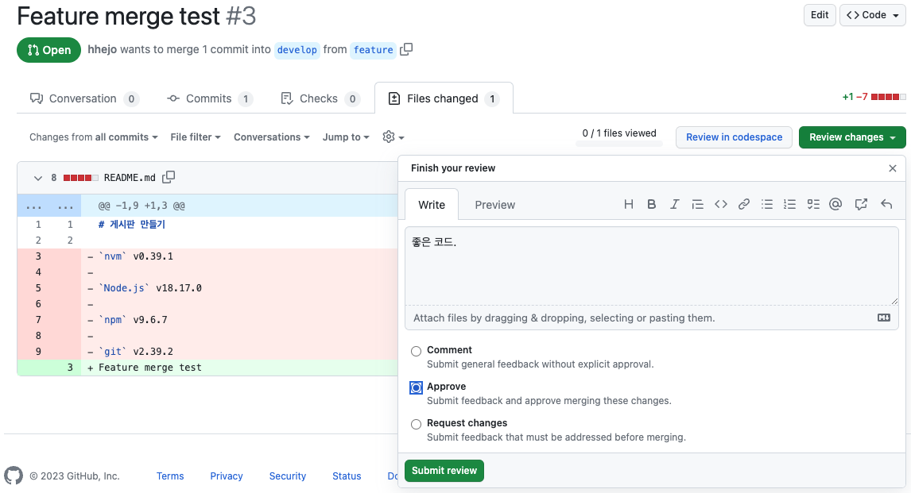

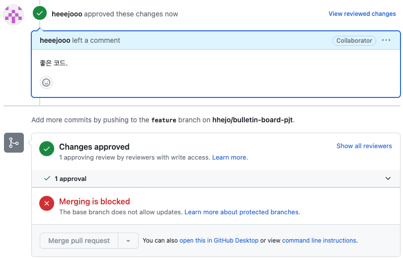

# 8. Merge 수행하기

필요한 수 만큼의 Review를 얻었다면, Merge를 수행할 수 있습니다.

Merge 완료된 `feature` 브랜치 삭제도 가능하고, Merge를 되돌릴(Revert) 수도 있습니다.

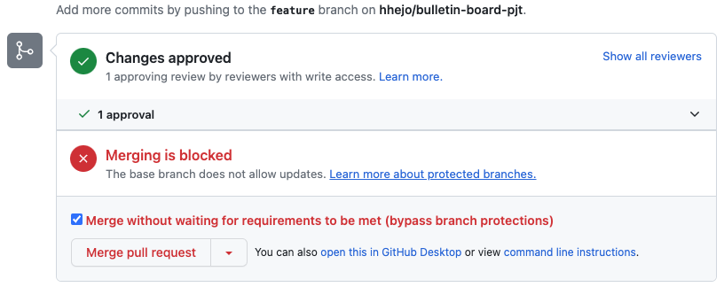

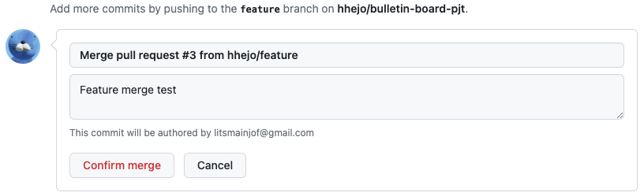

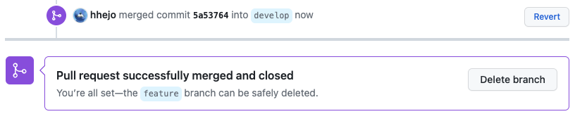

# 9. 결과 그래프 확인하기

현재까지 프로젝트의 커밋 그래프를 확인할 수 있습니다.

`Insights`을 클릭하고 `Network`를 클릭합니다.

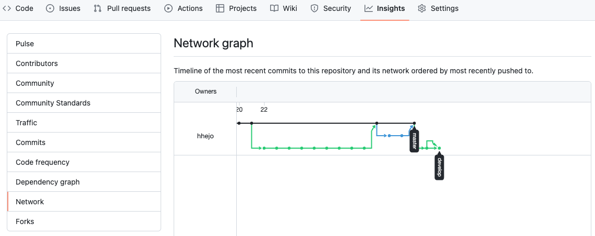

<br />
<br />

---
