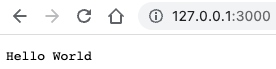
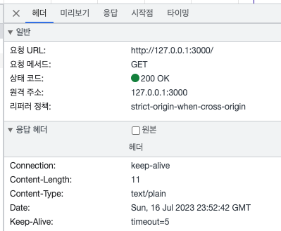
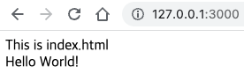

---

<br>

# 웹 서버 예제 실행해보기

`Node.js`와 `HTTP Module`을 이용해 웹 서버를 만들고 접속해보겠습니다.

### 1. `nvm`을 이용해 node를 사용합니다. 사용한 버전은 `v18.16.1`, `LTS` 버전입니다.

```bash
nvm use --lts
```

### 2. `server.js` 파일을 생성해 코드를 작성합니다.

- node.js의 내장(built-in) 모듈인 `http` 모듈을 사용합니다.
- 이 모듈은 HTTP로 데이터를 전송할 수 있게 해줍니다.

```javascript
const http = require('http');

const hostname = '127.0.0.1';
const port = 3000;

// node 웹 서버 애플리케이션의 웹 서버 객체
const server = http.createServer();
server.on('request', (req, res) => {
  res.statusCode = 200;
  res.setHeader('Content-Type', 'text/plain');
  res.end('Hello World');
});

// 웹 서버 실행
server.listen(port, hostname, () => {
  console.log(`Server running at http://${hostname}:${port}/`);
});

```

### 3. 서버를 실행하고, 웹 브라우저로 서버에 연결해봅니다.

터미널에 `node server.js`를 입력해 서버를 실행합니다.



해당 주소로 접속하면 Hello World가 잘 출력됩니다.



코드에 입력했었던 상태 코드와 Content-Type이 잘 나오고 있습니다.

### 4. 이번에는 HTML 파일을 전송해보겠습니다.

```html
<!-- index.html -->
<!DOCTYPE html>
<html lang="ko">
  <head>
    <meta charset="UTF-8" />
    <meta name="viewport" content="width=device-width, initial-scale=1.0" />
    <title>Document</title>
  </head>
  <body>
    <div>This is index.html</div>
    <div>Hello World!</div>
  </body>
</html>

```

```javascript
// server.js
const http = require('http');
const fs = require('fs');

const hostname = '127.0.0.1';
const port = 3000;

const server = http.createServer();
server.on('request', (req, res) => {
  fs.readFile('index.html', (err, data) => {
    res.writeHead(200, { 'Content-Type': 'text/html' });
    res.write(data);
    return res.end();
  });
});

server.listen(port, hostname, () => {
  console.log(`Server running at http://${hostname}:${port}/`);
});

```

node.js의 파일 입출력 모듈 `fs`를 이용합니다.

간단한 예제이기 때문에 에러 처리는 따로 하지 않았습니다.



HTML 파일이 잘 출력되는 것을 확인할 수 있습니다.

<br>
<br>

## 느낀점

짧은 HTML 파일만 전송했지만 템플릿 파일 만들기가 귀찮았습니다.

엄청 간단한 서버 예제였는데, 약간의 기능만 추가해도 코드가 점점 길어졌습니다. HTML 파일 한개만 보냈는데, 만약 URL이 몇 개 더 추가되고, 보내야 할 파일이 좀 더 많아지면, 코드가 감당이 안 될 것 같습니다.

Express.js 같은 것을 쓰는 이유를 조금 알게되었습니다.

그리고 `server.js` 파일을 수정했을 때, 끄고 재시작 하는 일이 번거로웠습니다..

<br>
<br>

# 참고

> [Node.js®에 대해서](https://nodejs.org/ko/about)

> [Node.js File System Module](https://www.w3schools.com/nodejs/nodejs_filesystem.asp)

---
